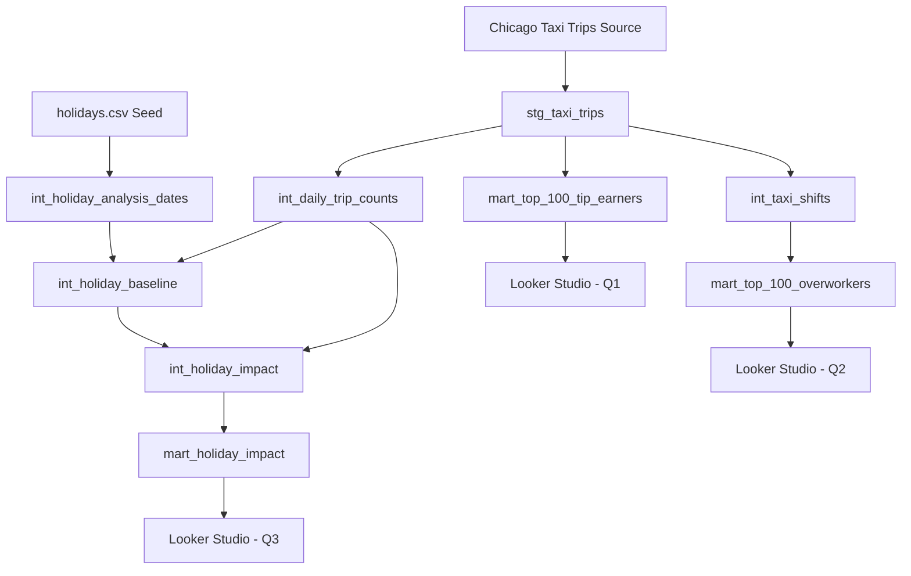

# Chicago Taxi Analytics

A dbt analytics engineering project using Google BigQuery and Chicago Taxi Trips data to answer three analytical questions around taxi tipping, long working shifts, and the impact of holidays on taxi-trip activity.

## 1. Overview

This project analyses Chicago taxi trip data using Google BigQuery and dbt to build reproducible analytical datasets from raw trip records.

The analysis focuses on three main questions:

1. Which taxi IDs are the highest tip earners?
2. Which taxi IDs recorded the highest number of long shifts during calendar year 2023?
3. How does taxi-trip activity change on holidays compared with comparable non-holiday dates?

The project follows a layered analytics engineering approach using staging, intermediate, and mart models. The final analytical marts are used as data sources for a Looker Studio dashboard.

### Deliverables

- **Dashboard:** [Chicago Taxi Analytics Dashboard](https://datastudio.google.com/reporting/f3f94de1-0c80-4386-933c-dd6ac59d83e0)
- **dbt documentation:** Generate locally using `dbt docs generate` and view using `dbt docs serve`
- **Final analytical marts:**
  - `mart_top_100_tip_earners`
  - `mart_top_100_overworkers`
  - `mart_holiday_impact`

---

## 2. Architecture

The project uses **Google BigQuery** as the analytical data warehouse and **dbt** for transformation, testing, documentation, and model dependency management.

The data is transformed through three logical model layers:

1. **Staging**
2. **Intermediate**
3. **Marts**

A dbt seed, `holidays.csv`, provides the holiday reference data required for the holiday-impact analysis.

### High-Level Architecture

```text
Chicago Taxi Trips
        |
        v
+------------------+
|     Staging      |
|  stg_taxi_trips  |
+------------------+
        |
        v
+------------------+
|   Intermediate   |
| Business Logic   |
+------------------+
        |
        v
+------------------+
|      Marts       |
| Analytical Data  |
+------------------+
        |
        v
+------------------+
|  Looker Studio   |
|    Dashboard     |
+------------------+

holidays.csv
     |
     +------> Holiday Analysis Models
```

### Data Lineage



---

## 3. Model Layers

### Staging

The staging layer provides a clean and consistent interface to the raw Chicago Taxi Trips source data.

The main staging model is:

- `stg_taxi_trips`

The staging layer is kept separate from analytical business logic so that source preparation can be maintained independently from downstream calculations.

### Intermediate

The intermediate layer contains reusable analytical transformations required before producing the final marts.

The main intermediate models are:

- `int_taxi_shifts`
- `int_daily_trip_counts`
- `int_holiday_analysis_dates`
- `int_holiday_baseline`
- `int_holiday_impact`

These models separate complex transformation and business logic from the final presentation layer.

This makes the analytical logic easier to inspect, test, debug, and maintain.

### Marts

The mart layer contains the final datasets designed for analytical and dashboard consumption.

#### Q1 — Top Tip Earners

`mart_top_100_tip_earners`

Produces the final ranking used to analyse taxi IDs by recorded tips.

#### Q2 — Long-Shift Analysis

`mart_top_100_overworkers`

Produces the final ranking of taxi IDs based on the number of derived long shifts during calendar year 2023.

#### Q3 — Holiday Impact

`mart_holiday_impact`

Produces the final holiday-level dataset used to compare taxi-trip activity on holidays with comparable non-holiday baseline dates.

These three marts are used as the analytical sources for the Looker Studio dashboard.

---

## 4. Project Structure

```text
taxi_analytics/
│
├── analyses/
│
├── macros/
│
├── models/
│   │
│   ├── staging/
│   │   └── stg_taxi_trips.sql
│   │
│   ├── intermediate/
│   │   ├── int_daily_trip_counts.sql
│   │   ├── int_holiday_analysis_dates.sql
│   │   ├── int_holiday_baseline.sql
│   │   ├── int_holiday_impact.sql
│   │   └── int_taxi_shifts.sql
│   │
│   ├── marts/
│   │   ├── mart_top_100_tip_earners.sql
│   │   ├── mart_top_100_overworkers.sql
│   │   └── mart_holiday_impact.sql
│   │
│   ├── schema.yml
│   │
│   └── staging/
│       └── sources.yml
│
├── seeds/
│   └── holidays.csv
│
├── snapshots/
│
├── tests/
│
├── .gitignore
├── dbt_project.yml
└── README.md
```

The `target/` directory and local credential/configuration files are intentionally excluded from version control.

---

## 5. Setup and Reproduction

The following steps describe how to reproduce the project from a clean environment.

### Prerequisites

Before starting, ensure the following are available:

- Git
- Python
- Google Cloud access
- Google BigQuery access
- dbt Core
- dbt BigQuery adapter

---

### 1. Clone the Repository

```bash
git clone https://github.com/umarfaridjalaluddin-coder/chicago-taxi-analytics.git
cd chicago-taxi-analytics
```

---

### 2. Create a Python Virtual Environment

Create the environment:

```bash
python -m venv .venv
```

#### Windows PowerShell

```powershell
.venv\Scripts\Activate.ps1
```

#### Linux / WSL / macOS

```bash
source .venv/bin/activate
```

---

### 3. Install dbt

Install dbt with the BigQuery adapter:

```bash
pip install dbt-bigquery
```

Confirm the installation:

```bash
dbt --version
```

---

### 4. Configure Google Cloud Authentication

The environment running dbt must have permission to access the required Google Cloud and BigQuery resources.

Configure Google Cloud authentication using the authentication method appropriate for your environment.

For example, when using Google Cloud CLI application default credentials:

```bash
gcloud auth application-default login
```

Alternatively, configure an approved service-account authentication method.

> **Security:** Never commit service-account JSON files, private keys, access tokens, passwords, or other credentials to this repository.

---

### 5. Configure `profiles.yml`

dbt requires a local profile containing the BigQuery connection configuration.

The profile should be stored in the standard dbt configuration location, normally:

```text
~/.dbt/profiles.yml
```

Example structure:

```yaml
taxi_analytics:
  target: dev

  outputs:
    dev:
      type: bigquery
      method: oauth
      project: <YOUR_GCP_PROJECT_ID>
      dataset: <YOUR_BIGQUERY_DATASET>
      threads: 4
      timeout_seconds: 300
      location: <YOUR_BIGQUERY_LOCATION>
```

Replace the placeholders with the appropriate values for your environment.

The profile configuration should correspond to the profile referenced by `dbt_project.yml`.

> `profiles.yml` may contain environment-specific configuration and should not be committed to the repository.

---

### 6. Verify the dbt Connection

Run:

```bash
dbt debug
```

A successful result confirms that dbt can read the project configuration and connect to BigQuery.

---

### 7. Load Seeds

Load the holiday reference dataset:

```bash
dbt seed
```

This loads:

```text
seeds/holidays.csv
```

into the configured BigQuery target.

---

### 8. Build the Project

Run the complete dbt project:

```bash
dbt build
```

`dbt build` executes the project's models, tests, seeds, and other selected dbt resources according to the dependency graph.

Alternatively, models can be executed separately using:

```bash
dbt run
```

---

### 9. Run Tests

Run the project tests:

```bash
dbt test
```

The project contains both dbt schema tests and custom SQL data-quality tests.

Tests cover areas including:

- required values
- expected row counts
- ranking boundaries
- model grain and uniqueness
- shift consistency
- holiday baseline validity
- holiday impact boundaries
- reconciliation between intermediate and mart outputs

---

### 10. Generate dbt Documentation

Generate the documentation:

```bash
dbt docs generate
```

Launch the documentation site locally:

```bash
dbt docs serve
```

The generated dbt documentation provides model metadata, dependencies, and lineage information.

---

## 6. Analytical Outputs

### Q1 — Top 100 Tip Earners

The first analytical output ranks taxi IDs according to recorded tip values.

Final model:

```text
mart_top_100_tip_earners
```

This mart provides the final dataset used for the Q1 dashboard analysis.

---

### Q2 — Top 100 Overworkers

The second analytical output evaluates taxi activity using derived shift information and ranks taxi IDs according to the number of qualifying long shifts during calendar year 2023.

Final model:

```text
mart_top_100_overworkers
```

The supporting shift logic is separated into:

```text
int_taxi_shifts
```

This separation keeps shift derivation logic independent from final ranking and presentation logic.

---

### Q3 — Holiday Impact on Taxi Trips

The third analytical output measures changes in taxi-trip activity on holidays compared with comparable non-holiday baseline dates.

Supporting models include:

```text
int_daily_trip_counts
int_holiday_analysis_dates
int_holiday_baseline
int_holiday_impact
```

The final analytical output is:

```text
mart_holiday_impact
```

The resulting mart is used to compare holiday taxi activity with its calculated baseline and present the resulting impact in Looker Studio.

---

## 7. Data Quality and Engineering Decisions

The project separates transformation logic from validation logic so that important assumptions and analytical rules can be tested independently.

### Taxi Identity and Q2 Interpretation

**Decision**

Use the taxi identifier available in the source data as the analytical entity for taxi-level ranking and shift analysis.

For Q2, the analysis is interpreted as identifying taxi IDs associated with the highest number of qualifying long shifts during calendar year 2023.

**Alternative considered**

An alternative would be to interpret the analysis at an individual driver level.

**Reason**

The available analytical source identifies taxi activity using taxi IDs. A taxi ID can therefore be analysed directly without assuming that it uniquely represents one individual driver.

**Trade-off / limitation**

The results describe activity associated with taxi IDs rather than confirmed individual human drivers. Therefore, the analysis should not be interpreted as a definitive measure of individual driver working behaviour.

---

### Incomplete Trip End Timestamps

**Decision**

Trips without sufficient end-time information are not treated as fully completed shift-ending observations where the analytical logic requires a valid trip end timestamp.

**Alternative considered**

Missing trip-end timestamps could be imputed or replaced using an estimated value.

**Reason**

Imputing an end timestamp would introduce an assumption that is not directly supported by the source record. This could distort calculated durations and derived shift boundaries.

**Trade-off / limitation**

Some taxi activity may therefore be excluded from duration-dependent calculations when the required timestamp information is incomplete.

---

### Extreme Trip Durations

**Decision**

Duration-related logic is validated using explicit data-quality tests rather than silently modifying unusual observations without evidence.

**Alternative considered**

Extreme trip durations could be automatically capped, winsorised, or removed.

**Reason**

Automatically changing extreme values would introduce an additional analytical assumption. Keeping the underlying observations while testing relevant boundaries makes the treatment more transparent.

**Trade-off / limitation**

Unusual but valid source records may still influence downstream duration-based analysis if they satisfy the implemented business rules.

---

### Exclusion of 2020–2021 from Holiday Analysis

**Decision**

The holiday analysis excludes 2020–2021.

**Alternative considered**

Use all available years in the holiday comparison.

**Reason**

The 2020–2021 period represents an abnormal period for transportation activity and may not provide a comparable baseline for normal taxi demand patterns.

Removing these years reduces the risk that exceptional travel behaviour materially distorts the holiday comparison.

**Trade-off / limitation**

The holiday analysis therefore covers a narrower historical period and does not attempt to describe holiday behaviour during 2020–2021.

---

### Holiday Baseline Contamination

**Decision**

Holiday activity is compared against constructed non-holiday baseline dates rather than using holiday dates as their own comparison observations.

**Alternative considered**

Use a simpler overall daily average or allow holiday observations to enter the comparison baseline.

**Reason**

Including holidays in the baseline could contaminate the reference level being used to measure holiday effects.

Separating holiday observations from comparable non-holiday dates provides a cleaner analytical comparison.

**Trade-off / limitation**

The resulting impact remains dependent on the implemented baseline-selection methodology. It should therefore be interpreted as an analytical comparison rather than a causal estimate of the effect of a holiday.

---

## 8. Data Quality Tests

The repository includes custom SQL tests under:

```text
tests/
```

Examples include:

```text
test_holiday_baseline_days_valid.sql
test_holiday_baseline_trip_count_nonnegative.sql
test_holiday_impact_lower_bound.sql
test_holiday_summary_year_counts_reconcile.sql
test_int_holiday_analysis_dates_unique_grain.sql
test_int_holiday_baseline_unique_grain.sql
test_int_holiday_impact_unique_grain.sql
test_int_taxi_shifts_unique_grain.sql
test_mart_top_100_overworkers_row_count.sql
test_mart_top_100_tip_earners_row_count.sql
test_overworker_rank_bounds.sql
test_overworkers_long_shift_count_valid.sql
test_overworkers_rates_valid.sql
test_overworkers_shift_counts_reconcile.sql
test_q1_tips_not_null.sql
test_taxi_shifts_incomplete_end_consistency.sql
test_tip_earner_rank_bounds.sql
```

These tests provide additional validation beyond model construction and help detect unexpected changes in analytical assumptions or output structure.

---

## 9. Dashboard

The final analytical marts are visualised using Google Looker Studio.

### Chicago Taxi Analytics Dashboard

[Open the Chicago Taxi Analytics Dashboard](https://datastudio.google.com/reporting/f3f94de1-0c80-4386-933c-dd6ac59d83e0)

The dashboard presents the outputs corresponding to the three analytical questions:

- **Q1:** Top tip-earning taxi IDs
- **Q2:** Taxi IDs with the highest number of qualifying long shifts
- **Q3:** Holiday impact on taxi-trip activity

The dashboard is the presentation layer, while the analytical and business logic remains implemented and version-controlled within dbt.

---

## 10. Technology Stack

| Technology | Purpose |
|---|---|
| Google BigQuery | Analytical data warehouse |
| dbt Core | Data transformation and model management |
| SQL | Transformation and analytical logic |
| dbt Seeds | Holiday reference data |
| dbt Tests | Data-quality validation |
| dbt Docs | Documentation and lineage |
| Looker Studio | Dashboard and visualisation |
| Git | Local version control |
| GitHub | Source-code repository |

---

## 11. Reproducibility and Security

The repository contains the transformation logic, model definitions, seed data, tests, and documentation required to understand and reproduce the analytical workflow.

Environment-specific credentials are intentionally excluded from version control.

The `.gitignore` prevents common generated or sensitive files from being committed, including items such as:

```text
target/
dbt_packages/
logs/
.env
profiles.yml
*.pem
*.key
*.p12
*.pfx
*service-account*.json
*credentials*.json
.vscode/
.idea/
.DS_Store
Thumbs.db
```

Users reproducing the project must configure their own Google Cloud authentication and dbt profile.

---

## 12. Validation Summary

The project uses multiple levels of validation:

- Source preparation through the staging layer
- Separation of reusable business logic into intermediate models
- Final analytical outputs isolated in mart models
- Schema-level dbt tests
- Custom SQL tests for business-rule validation
- Reconciliation tests between intermediate and final outputs
- Explicit handling and documentation of analytical limitations

This structure is intended to keep the analysis reproducible, testable, and easier to maintain.

---

## Repository

**GitHub:**  
[umarfaridjalaluddin-coder/chicago-taxi-analytics](https://github.com/umarfaridjalaluddin-coder/chicago-taxi-analytics)

**Dashboard:**  
[Chicago Taxi Analytics Dashboard](https://datastudio.google.com/reporting/f3f94de1-0c80-4386-933c-dd6ac59d83e0)