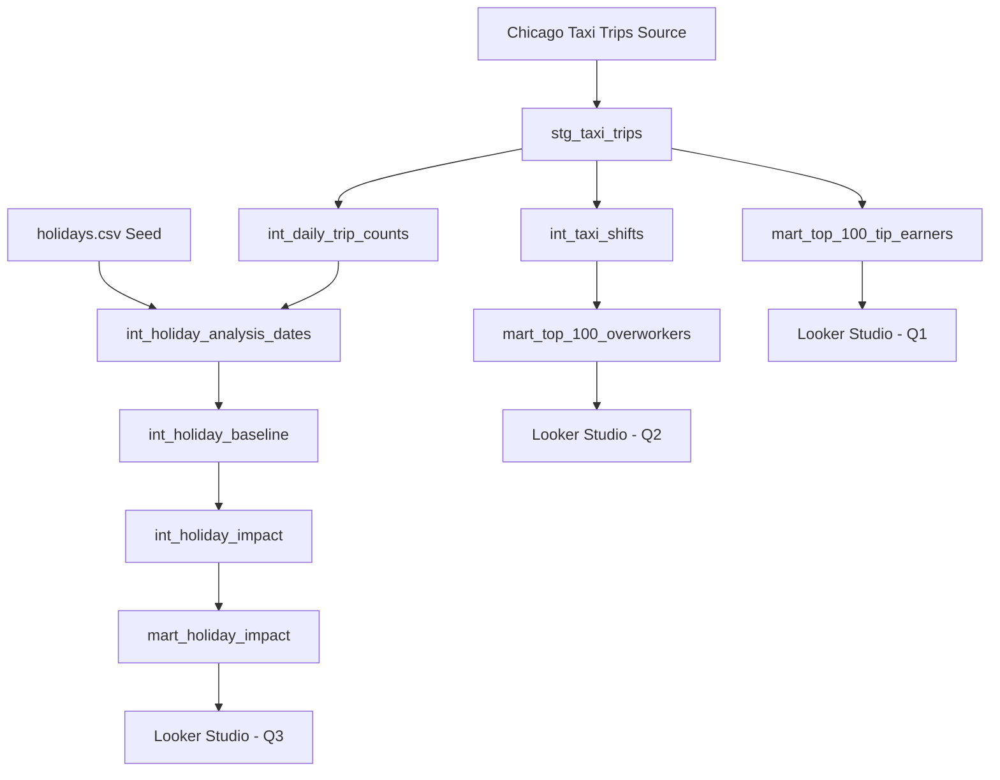

# Chicago Taxi Analytics

A dbt analytics engineering project built on Google BigQuery using Chicago Taxi Trips data.

The project transforms raw taxi-trip records into tested analytical marts that answer three business questions: which taxi IDs generate the most recorded tips, which taxi IDs have the highest number of derived long shifts during 2023, and how taxi-trip activity changes during holidays compared with comparable non-holiday dates.

The final analytical marts are used as data sources for a Looker Studio dashboard.

---

## 1. Project Overview

This project demonstrates an end-to-end analytics engineering workflow using:

- Google BigQuery as the analytical data warehouse
- dbt for transformation, testing, documentation, and lineage
- SQL for analytical and business logic
- dbt seeds for holiday reference data
- Custom data-quality tests for important analytical assumptions
- Looker Studio for dashboard reporting

The analysis addresses three questions:

### Q1 — Top Tip Earners

Which taxi IDs have the highest total recorded tips?

Final model:

`mart_top_100_tip_earners`

### Q2 — Long-Shift / Overworker Analysis

Which taxi IDs have the highest number of derived long shifts during calendar year 2023?

Final model:

`mart_top_100_overworkers`

### Q3 — Holiday Impact

How does taxi-trip activity on holidays compare with comparable non-holiday baseline dates?

Final model:

`mart_holiday_impact`

---

## 2. Deliverables

### Looker Studio Dashboard

[Chicago Taxi Analytics Dashboard](https://datastudio.google.com/reporting/f3f94de1-0c80-4386-933c-dd6ac59d83e0)

### Final Analytical Marts

- `mart_top_100_tip_earners`
- `mart_top_100_overworkers`
- `mart_holiday_impact`

### dbt Documentation

Generate the dbt documentation locally with:

```bash
dbt docs generate
dbt docs serve
```

This provides model documentation, dependencies, tests, and lineage information generated from the dbt project.

---

## 3. Architecture

The project follows a layered analytics engineering architecture:

```text
Chicago Taxi Trips
        |
        v
+------------------+
|     Staging      |
| stg_taxi_trips   |
+------------------+
        |
        v
+---------------------------+
|       Intermediate        |
|                           |
| int_taxi_shifts           |
| int_daily_trip_counts     |
| int_holiday_analysis_dates|
| int_holiday_baseline      |
| int_holiday_impact        |
+---------------------------+
        |
        +----------------------------+
        |              |             |
        v              v             v
+---------------+ +---------------+ +---------------+
| Q1 Mart       | | Q2 Mart       | | Q3 Mart       |
| Tip Earners   | | Overworkers   | | Holiday Impact|
+---------------+ +---------------+ +---------------+
        |              |             |
        +--------------+-------------+
                       |
                       v
              Looker Studio Dashboard
```

The holiday analysis additionally uses:

```text
seeds/holidays.csv
```

as a dbt seed containing holiday reference information.

---

## 4. Data Lineage



The dbt DAG remains the authoritative source for exact model dependencies.

---

## 5. Model Layers

### Staging

The staging layer provides a controlled interface between the raw Chicago Taxi Trips source and downstream analytical models.

Primary model:

```text
models/staging/stg_taxi_trips.sql
```

The purpose of staging is to centralise source-level preparation so downstream models do not repeatedly operate directly on the raw source.

---

### Intermediate

The intermediate layer contains reusable transformations and analytical business logic.

Main intermediate models include:

```text
int_taxi_shifts
int_daily_trip_counts
int_holiday_analysis_dates
int_holiday_baseline
int_holiday_impact
```

Examples of responsibilities handled here include:

- deriving taxi activity periods used for Q2
- aggregating taxi activity to daily grain
- identifying holiday analysis dates
- constructing comparable non-holiday baselines
- calculating holiday-level trip impacts

Keeping these transformations separate from the final marts makes the analytical logic easier to inspect, test, debug, and maintain.

---

### Marts

The mart layer contains the final datasets intended for analytical and dashboard consumption.

```text
mart_top_100_tip_earners
mart_top_100_overworkers
mart_holiday_impact
```

Each mart is designed around one of the three analytical questions.

These marts are used as data sources for the Looker Studio dashboard.

---

## 6. Repository Structure

```text
taxi_analytics/
|
|-- analyses/
|
|-- macros/
|
|-- models/
|   |
|   |-- staging/
|   |   `-- stg_taxi_trips.sql
|   |
|   |-- intermediate/
|   |   |-- int_daily_trip_counts.sql
|   |   |-- int_holiday_analysis_dates.sql
|   |   |-- int_holiday_baseline.sql
|   |   |-- int_holiday_impact.sql
|   |   `-- int_taxi_shifts.sql
|   |
|   |-- marts/
|   |   |-- mart_top_100_tip_earners.sql
|   |   |-- mart_top_100_overworkers.sql
|   |   `-- mart_holiday_impact.sql
|   |
|   |-- schema.yml
|   `-- staging/
|       `-- sources.yml
|
|-- seeds/
|   `-- holidays.csv
|
|-- snapshots/
|
|-- tests/
|
|-- .gitignore
|-- dbt_project.yml
`-- README.md
```

Generated dbt artifacts such as `target/`, logs, local credentials, and local environment files are excluded from version control.

---

## 7. Setup and Reproduction

The following steps describe how to reproduce the project from a clean environment.

### 7.1 Clone the Repository

```bash
git clone https://github.com/umarfaridjalaluddin-coder/chicago-taxi-analytics.git
cd chicago-taxi-analytics
```

---

### 7.2 Create a Python Virtual Environment

```bash
python -m venv .venv
```

On Linux / WSL:

```bash
source .venv/bin/activate
```

On Windows PowerShell:

```powershell
.venv\Scripts\Activate.ps1
```

---

### 7.3 Install dbt

Install the BigQuery adapter:

```bash
pip install dbt-bigquery
```

Verify the installation:

```bash
dbt --version
```

---

### 7.4 Configure Google Cloud Authentication

The project requires access to Google BigQuery.

Authentication should be configured locally using an appropriate Google Cloud authentication method.

Do not commit:

- service-account private keys
- credential JSON files
- passwords
- tokens
- `.env` files containing secrets

Authentication credentials must remain outside version control.

---

### 7.5 Configure `profiles.yml`

dbt connection configuration should be stored in the local dbt profile rather than committed with credentials.

A typical BigQuery profile structure is:

```yaml
taxi_analytics:
  target: dev

  outputs:
    dev:
      type: bigquery
      method: oauth
      project: YOUR_GCP_PROJECT_ID
      dataset: YOUR_BIGQUERY_DATASET
      threads: 4
      location: YOUR_BIGQUERY_LOCATION
```

Replace the placeholder values with the appropriate local Google Cloud configuration.

The actual authentication configuration may vary depending on the authentication method used.

---

### 7.6 Verify the dbt Connection

Run:

```bash
dbt debug
```

Resolve any authentication or profile errors before continuing.

---

### 7.7 Load dbt Seeds

Load the holiday reference dataset:

```bash
dbt seed
```

This loads:

```text
seeds/holidays.csv
```

into BigQuery.

---

### 7.8 Build the Project

Run:

```bash
dbt build
```

This executes the applicable dbt resources and tests in dependency order.

---

### 7.9 Run Tests

Tests can also be executed independently:

```bash
dbt test
```

The project contains both schema-based tests and custom SQL data-quality tests.

---

### 7.10 Generate Documentation

```bash
dbt docs generate
dbt docs serve
```

This generates and opens the dbt documentation site locally.

---

## 8. Analytical Approach

### Q1 — Top Tip Earners

The first analysis ranks taxi IDs according to total recorded tip amounts.

Final output:

```text
mart_top_100_tip_earners
```

The mart is designed to provide a ranked analytical result for dashboard consumption.

---

### Q2 — Long-Shift Analysis

The second analysis derives taxi activity periods from trip records and identifies taxi IDs with the highest number of long derived shifts during 2023.

The main transformation is:

```text
int_taxi_shifts
```

The final ranking is produced by:

```text
mart_top_100_overworkers
```

The term "shift" in this project refers to a shift derived analytically from taxi-trip activity rather than an official driver employment schedule.

This distinction is important because the source data contains taxi-trip activity rather than explicit employee shift records.

---

### Q3 — Holiday Impact

The holiday analysis compares observed holiday taxi-trip activity against comparable non-holiday baseline dates.

The transformation pipeline includes:

```text
int_daily_trip_counts
        |
        v
int_holiday_analysis_dates
        |
        v
int_holiday_baseline
        |
        v
int_holiday_impact
        |
        v
mart_holiday_impact
```

The final mart provides holiday-level impact measures used by the Looker Studio dashboard.

---

## 9. Data Quality and Engineering Decisions

### 9.1 Taxi Identity and Q2 Interpretation

**Decision**

Use the taxi identifier available in the source data as the analytical entity for Q2 and describe the result as taxi-level activity rather than making unsupported claims about individual human drivers.

**Alternative considered**

Interpret each taxi identifier directly as a unique driver.

**Reason**

The available identifier represents a taxi entity in the source data. Treating it as a guaranteed one-to-one driver identifier would introduce an assumption that is not established by the analytical dataset.

**Trade-off / limitation**

The Q2 results identify taxis associated with high numbers of derived long shifts. They should not automatically be interpreted as proof that one individual driver personally worked every observed trip or shift.

---

### 9.2 Incomplete Trip End Timestamps

**Decision**

Preserve derived shifts affected by missing trip end timestamps and flag them explicitly rather than dropping them or fabricating an end time.

Affected shifts are identified using:

```text
has_incomplete_end_time
```

A dedicated consistency test validates that the incomplete-end flag remains aligned with the underlying timestamp condition.

**Alternative considered**

Drop incomplete records before shift construction or impute a replacement end timestamp.

**Reason**

Dropping these observations would hide an existing source-data quality issue and could change the observed activity population.

Imputing an end timestamp would introduce unsupported information and could distort derived shift duration.

Preserving and flagging the affected shifts keeps the issue visible and auditable without inventing data.

**Trade-off / limitation**

Duration-based measures for affected shifts require caution because the true shift end is not fully observed.

These records are retained for transparency but should not be interpreted as having the same duration reliability as fully observed shifts.

---

### 9.3 Active-Trip-Duration Plausibility Treatment

**Decision**

Apply a plausibility treatment to `total_active_trip_hours` while preserving the underlying trip in shift construction.

For the active-trip-hours calculation:

- `trip_seconds IS NULL` contributes `0`
- `trip_seconds > 14400` seconds (4 hours) contributes `0`
- otherwise the recorded `trip_seconds` value is used

The trip itself is not removed, and this treatment does not redefine `shift_duration_hours`.

**Alternative considered**

Remove trips above the four-hour threshold entirely or use their full recorded duration in `total_active_trip_hours`.

**Reason**

Removing the trip could change trip sequencing and therefore alter derived shift boundaries.

Using the complete extreme value could allow an implausibly large trip duration to dominate the supporting active-hours metric.

Zeroing only the contribution to `total_active_trip_hours` preserves the trip's role in shift construction while limiting its influence on that supporting metric.

**Trade-off / limitation**

`total_active_trip_hours` is therefore a plausibility-adjusted supporting measure rather than a literal sum of every recorded `trip_seconds` value.

---

### 9.4 Exclusion of 2020–2021 from Holiday Analysis

**Decision**

Exclude 2020 and 2021 from the primary holiday-impact comparison.

**Alternative considered**

Include all available years in the holiday analysis.

**Reason**

Taxi activity during 2020 and 2021 was affected by exceptional pandemic-related changes in mobility and travel behaviour.

Including those years in a historical holiday comparison could cause pandemic-related structural effects to be interpreted incorrectly as normal holiday effects.

**Trade-off / limitation**

The resulting holiday analysis covers fewer years, reducing the historical sample available for comparison.

However, the remaining years provide a more comparable basis for interpreting typical holiday-related changes.

---

### 9.5 Holiday Baseline Contamination

**Decision**

Construct holiday baselines using comparable non-holiday dates and prevent holiday dates from contaminating the comparison population.

**Alternative considered**

Compare each holiday against a broader daily average without explicitly excluding other holidays.

**Reason**

Including holiday observations in the baseline could distort the reference level being used to estimate holiday impact.

A holiday should be compared with dates intended to represent normal activity rather than dates that may themselves contain holiday-related behaviour.

**Trade-off / limitation**

Stricter baseline eligibility reduces the number of dates available for comparison.

The approach prioritises comparability and interpretability over maximising the baseline sample size.

---

## 10. Data Quality Testing

Testing is treated as part of the analytical design rather than only as a final validation step.

The repository contains custom SQL tests covering areas such as:

- null tip validation
- ranking boundaries
- expected mart row counts
- derived shift grain
- incomplete shift-end consistency
- long-shift count validation
- overworker rate validation
- shift-count reconciliation
- holiday analysis grain
- holiday baseline grain
- holiday baseline validity
- non-negative baseline trip counts
- holiday impact boundaries
- holiday summary reconciliation

Tests are stored under:

```text
tests/
```

and schema-level tests are defined in:

```text
models/schema.yml
```

Run the complete test suite with:

```bash
dbt test
```

or as part of:

```bash
dbt build
```

---

## 11. Security and Credential Handling

Sensitive credentials are intentionally excluded from Git version control.

The `.gitignore` excludes common sensitive and generated files, including:

```text
.env
profiles.yml
*.pem
*.key
*.p12
*.pfx
*service-account*.json
*credentials*.json
target/
logs/
dbt_packages/
```

Google Cloud credentials and service-account secrets should never be committed to the repository.

A public repository should contain only source code, configuration templates, documentation, tests, and non-sensitive project assets.

---

## 12. Dashboard

The final analytical marts are connected to Looker Studio.

The dashboard presents the outputs for:

- Q1 — top taxi IDs by recorded tips
- Q2 — taxi IDs with the highest number of derived long shifts
- Q3 — historical holiday impact on taxi-trip activity

Dashboard:

[Chicago Taxi Analytics Dashboard](https://datastudio.google.com/reporting/f3f94de1-0c80-4386-933c-dd6ac59d83e0)

---

## 13. Technology Stack

| Technology | Purpose |
|---|---|
| Google BigQuery | Cloud analytical data warehouse |
| dbt | Data transformation, testing, documentation and lineage |
| SQL | Transformation and analytical logic |
| dbt Seeds | Holiday reference data |
| Looker Studio | Dashboard and visualisation |
| Git | Local version control |
| GitHub | Source-code hosting and project portfolio |

---

## 14. Current Reproducibility Note

Local dbt execution requires valid Google Cloud authentication and a correctly configured `profiles.yml`.

Credentials are intentionally not included in this public repository.

Users reproducing the project should configure their own Google Cloud credentials and BigQuery environment before running:

```bash
dbt debug
dbt seed
dbt build
dbt test
```

---

## 15. Future Improvements

Potential improvements include:

- automated CI validation using GitHub Actions
- a committed `profiles.yml.example` containing placeholders only
- additional automated source-quality monitoring
- expanded dashboard documentation
- additional analysis of seasonal and temporal taxi-demand patterns

---

## 16. Author

**Umar Farid**

Chicago Taxi Analytics  
Analytics Engineering Project

Technologies demonstrated:

`BigQuery` · `dbt` · `SQL` · `Data Quality Testing` · `Looker Studio` · `Git` · `GitHub`